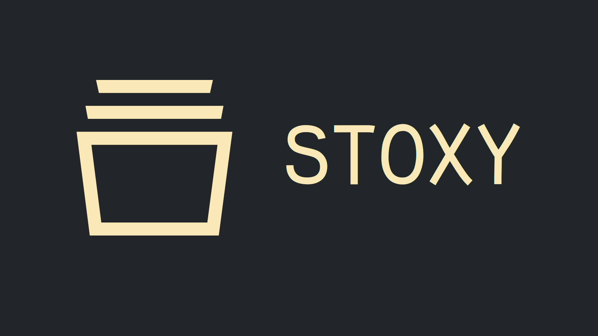

# 🗂️ StoxyHooks

**Stoxy Hooks are still highly WIP**

Stoxy is a state management API equipped with Web Components.

Stoxy allows you to easily handle, persist and update data in your DOM without the weight of a framework.


# 📖 Official docs

Official docs can be found [here](https://stoxy.dev)

## 🧰 Installation

Install [Stoxy](https://github.com/Matsuuu/stoxy) into your dependencies

```sh
npm install @stoxy/core
```

Then install this library to enable the mixin support

```sh
npm install @stoxy/hooks
```

## Usage

